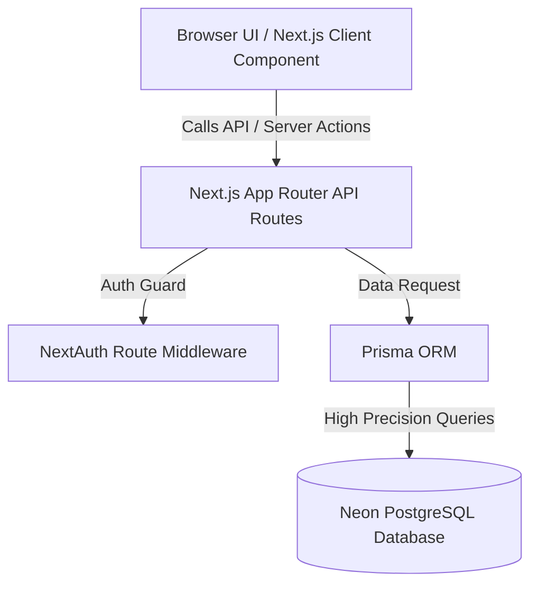

# AasaMedChem Inventory & Order Management System

AasaMedChem is a full-stack inventory and order management system built with Next.js 14, Neon PostgreSQL, Prisma, NextAuth.js, and Tailwind CSS + shadcn/ui. It manages chemical products, tracks stocks in base storage units, handles internal sales orders from Sellers, and facilitates quotation worksheets and negotiations with external Buyers.

---

## 1. Project Overview

The system divides responsibilities among three distinct user roles:
*   **ADMIN**: Manages products, categories, base units, pricing, and stock levels. Reviews all incoming sales orders and quotation worksheets, inputs quoted prices per base unit, and verifies that conversion rates and totals are correct. Registers users.
*   **SELLER**: Internal sales agent. Browses active products with internal pricing, adds items to the cart, chooses quantities in any compatible display unit (e.g. grams or kilograms), and checks out orders. Live prices and conversions update reactively.
*   **BUYER**: External client. Browses active catalog items. If the product price is public, the buyer sees it and can estimate totals. Otherwise, the buyer submits a quote request cart. Upon review, the buyer accepts or declines quotes issued by the Admin.

---

## 2. Live URL and Test Credentials

*   **Production Deployment**: [AasaMedChem Vercel URL](https://aasamedchem-inventory.vercel.app) *(or replace with your actual Vercel live URL)*
*   **Test Credentials**:
    *   **Admin**: `admin@aasa.com` / `admin123` (Role: `ADMIN`)
    *   **Seller**: `seller@aasa.com` / `seller123` (Role: `SELLER`)
    *   **Buyer**: `buyer@aasa.com` / `buyer123` (Role: `BUYER`, Company: `Test Pharma Co.`)

---

## 3. Tech Stack

*   **Framework**: Next.js 14 (App Router)
*   **Database**: Neon Serverless PostgreSQL
*   **ORM**: Prisma ORM (v5.14.0)
*   **Authentication**: NextAuth.js (v4.24.7 Credentials Provider)
*   **Styling & UI**: Tailwind CSS, shadcn/ui (Radix UI primitives), Lucide React icons, and Sonner toasts.
*   **Validation**: Custom validators, Zod schemas, and client-side password validations.

---

## 4. System Design



*   **Role-Based Middleware Flow**: Middleware protects all routes starting with `/admin/*`, `/seller/*`, and `/buyer/*`. It decodes the NextAuth JWT to extract the user's role. If a user tries to access a path that doesn't match their role, they are redirected to their corresponding role dashboard.
*   **API Layer Routing**: API routes check authorization server-side using `getServerSession(authOptions)` before processing database operations.

---

## 5. Database Schema

The database consists of 6 tables mapping relations:

1.  **users** (`User`): Stores user credentials.
    *   `id` (UUID, PK): Unique identifier.
    *   `email` (Text, Unique): Login identifier.
    *   `password` (Text): Bcrypt hashed password.
    *   `name` (Text): Display name.
    *   `role` (Enum: `ADMIN`, `SELLER`, `BUYER`): Session access control.
    *   `company_name` (Text, Nullable): Mandatory for Buyers.
    *   `phone` (Text, Nullable): Mobile contact.
    *   `created_at` / `updated_at`: Audit timestamps.
2.  **products** (`Product`): Catalog database.
    *   `id` (UUID, PK).
    *   `name` (Text).
    *   `sku` (Text, Unique): Product SKU identifier.
    *   `description` (Text, Nullable).
    *   `category` (Text, Nullable).
    *   `base_unit` (Enum: `GRAM`, `KILOGRAM`, `LITER`, `MILLILITER`, `UNIT`): Stored unit configuration.
    *   `base_price` (Decimal(20,6)): Price in INR per one base unit.
    *   `stock_quantity` (Decimal(20,6)): Current quantity in the base unit.
    *   `is_active` (Boolean): Deactivation flag.
    *   `is_price_public` (Boolean): Price visibility rule.
3.  **orders** (`Order`): Placed by Sellers.
    *   `id` (UUID, PK).
    *   `seller_id` (UUID, FK -> `users`).
    *   `status` (Enum: `PENDING`, `CONFIRMED`, `REJECTED`).
    *   `total_amount` (Decimal(20,6)): Sum of all line totals.
    *   `notes` (Text, Nullable).
4.  **order_items** (`OrderItem`): Specific products inside a Seller order.
    *   `id` (UUID, PK).
    *   `order_id` (UUID, FK -> `orders` Cascade Delete).
    *   `product_id` (UUID, FK -> `products`).
    *   `ordered_unit` (Enum): The unit selected by the seller.
    *   `ordered_quantity` (Decimal(20,6)): Quantity in `ordered_unit`.
    *   `base_quantity` (Decimal(20,6)): Quantity converted to the product's base unit.
    *   `unit_price_at_order` (Decimal(20,6)): Price per base unit at the time of purchase.
    *   `line_total` (Decimal(20,6)): `base_quantity * unit_price_at_order`.
5.  **quotations** (`Quotation`): Requests created by Buyers.
    *   `id` (UUID, PK).
    *   `buyer_id` (UUID, FK -> `users`).
    *   `status` (Enum: `PENDING`, `REVIEWED`, `QUOTED`, `CONFIRMED`, `REJECTED`).
    *   `buyer_notes` / `admin_notes` (Text, Nullable).
    *   `quoted_amount` (Decimal(20,6), Nullable): Sum of line totals once quoted by Admin.
6.  **quotation_items** (`QuotationItem`): Requested products in a Buyer quotation.
    *   `id` (UUID, PK).
    *   `quotation_id` (UUID, FK -> `quotations` Cascade Delete).
    *   `product_id` (UUID, FK -> `products`).
    *   `requested_unit` (Enum).
    *   `requested_quantity` (Decimal(20,6)).
    *   `base_quantity` (Decimal(20,6)): Converted to base unit.
    *   `quoted_unit_price` (Decimal(20,6), Nullable): Price set by Admin per base unit.
    *   `line_total` (Decimal(20,6), Nullable): `base_quantity * quoted_unit_price`.

---

## 6. Unit Storage and Conversion Strategy

All measurements belong to one of three dimensions: **Weight**, **Volume**, or **Count**. Stock counts and base prices are stored exclusively in the dimension's **Base Unit** (GRAM, MILLILITER, or UNIT).

### Conversion Factors:

| Unit | Dimension | Factor to Base | Compatible Units |
| :--- | :--- | :--- | :--- |
| **GRAM** | Weight (Base Unit) | 1 | GRAM, KILOGRAM |
| **KILOGRAM** | Weight | 1000 | GRAM, KILOGRAM |
| **MILLILITER**| Volume (Base Unit) | 1 | MILLILITER, LITER |
| **LITER** | Volume | 1000 | MILLILITER, LITER |
| **UNIT** | Count (Base Unit) | 1 | UNIT |

### Code Implementation (`src/lib/unit-conversion.ts`):
*   `toBaseUnit(quantity, unit)`: Multiplies quantity by conversion factor.
*   `fromBaseUnit(quantity, unit)`: Divides quantity by conversion factor.
*   `calculateLineTotal(orderedQty, orderedUnit, basePrice)`: Converts `orderedQty` to base unit, multiplies by the base price, and returns a high-precision float (capped to 6 decimal places).
*   `pricePerOrderedUnit(basePrice, orderedUnit)`: Returns the rate per ordered unit (`basePrice * factor`).
*   `isUnitCompatible(baseUnit, orderedUnit)`: Assures that unit types belong to the same dimension (e.g. rejects buying kilograms of distilled water in liters).

### Execution Contexts:
1.  **Frontend Forms**: Displays live updates as the user edits quantities or units (e.g. `2 kg = 2000 g` and `₹5/g → ₹5000/kg`).
2.  **API Handler Validation**: Confirms compatibility server-side, converts quantities to base units, and snaps prices before saving to the database.
3.  **Visual Audit Views**: Shows both the ordered/requested quantities and base equivalents so admins can verify correctness.

---

## 7. Price Storage

Prices are stored as **INR per Base Unit** using the PostgreSQL `numeric(20,6)` database type. 

### Why `numeric(20,6)`?
Floating-point types (like floats or doubles) introduce decimal roundoff errors due to binary representation. To avoid money leakage and ensure high precision (especially when converting small units like grams to large amounts like tons), `numeric(20,6)` provides up to 20 digits of precision with exactly 6 decimal places. This handles large transactions up to ₹99,999,999,999,999.999999.

---

## 8. Local Setup

Follow these steps to run the application locally:

1.  **Clone the Repository**:
    ```bash
    git clone <repository_url>
    cd "AasaMedChem Inventory & Order Management System"
    ```
2.  **Install Dependencies**:
    ```bash
    npm install
    ```
3.  **Configure Environment Variables**:
    Create a `.env` file in the root directory (based on `.env.local` or template):
    ```env
    DATABASE_URL="your_neon_postgres_connection_string"
    NEXTAUTH_SECRET="your_nextauth_jwt_signing_secret"
    NEXTAUTH_URL="http://localhost:3000"
    ```
4.  **Run Database Migrations**:
    ```bash
    npx prisma migrate dev --name init
    ```
5.  **Seed the Database**:
    Compile the seed script and execute:
    ```bash
    npx prisma db seed
    ```
6.  **Run Development Server**:
    ```bash
    npm run dev
    ```
    Open `http://localhost:3000` to access the system.

---

## 9. Vercel Deployment

Deploying the system to Vercel requires a few configurations:

1.  **Build Command Configuration**:
    Configure Vercel to generate the Prisma Client before building the Next.js bundle:
    *   Build Command: `npx prisma generate && next build`
2.  **Environment Variables**:
    Add `DATABASE_URL`, `NEXTAUTH_SECRET`, and `NEXTAUTH_URL` under the Project Settings -> Environment Variables dashboard in Vercel.

---

## 10. How to Use Each Panel (Step-by-Step)

### Step 1: Admin Adds a Product
1.  Log in as `admin@aasa.com` / `admin123`.
2.  Navigate to **Products** and click **Add Product**.
3.  Add "Sodium Chloride", category "Chemicals", base unit "GRAM", base price "0.05", initial stock "50000", and check **Public Pricing**.
4.  Notice the helper banner showing equivalent prices: `Equivalent: ₹50.00/KILOGRAM`. Click **Create**.

### Step 2: Seller Places an Order
1.  Log in as `seller@aasa.com` / `seller123`.
2.  Go to the products page, find "Sodium Chloride", and click **Add to Cart**.
3.  Go to the **Cart** page. Change the unit selector to **KILOGRAM** and input **2**.
4.  Verify the live conversion displays:
    *   `Rate: ₹0.05/GRAM`
    *   `Effective rate: ₹50.00/KILOGRAM`
    *   `You entered: 2 KILOGRAM = 2000 GRAM`
    *   `Line total: ₹100.00`
5.  Add optional order notes and click **Place Sales Order**.

### Step 3: Admin Confirms the Order
1.  Log in as `admin@aasa.com`.
2.  Go to **Orders** and click the expand icon on the seller's pending order.
3.  Inspect the conversion breakdown (`2 KILOGRAM = 2000 GRAM` at `₹0.05/GRAM`).
4.  Click **Confirm**. (If you click **Reject**, the 2000g stock is returned to the inventory).

### Step 4: Buyer Requests a Quotation
1.  Log in as `buyer@aasa.com` / `buyer123`.
2.  Go to the products catalog. Look for "Ethanol 99%" (which is not marked public). Notice the "Price on Request" tag. Click **Add to Quote Request**.
3.  Go to the **Quote Request** page. Change the unit to **LITER** and enter **5**.
4.  Verify that it displays: `Our team will provide custom pricing upon review`.
5.  Type notes: "Need this for urgent laboratory reagent testing" and click **Submit Quote Request**.

### Step 5: Admin Quotes a Price
1.  Log in as `admin@aasa.com`.
2.  Go to **Quotations** and expand the buyer's pending request.
3.  Click **Quote Pricing**. The worksheet calculator will slide open.
4.  Enter `0.80` (INR per mL base unit) in the quoted rate input. The calculator live-updates: `5 LITER = 5000 MILLILITER` -> `Line Total: ₹4000.00`.
5.  Enter admin notes and click **Save & Publish**.

### Step 6: Buyer Accepts the Quote
1.  Log in as `buyer@aasa.com`.
2.  Go to **Quotations** and expand the quoted request.
3.  Review the price details (₹4000.00 total) and click **Accept**.
4.  The quote status changes to `CONFIRMED` and the 5000mL of Ethanol is deducted from the product database.
